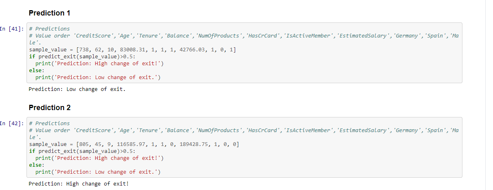

# Bank Customer's Churn Classification <h1> 
  
     

### Problem Statement 
Classifying bank customers based on their previous banking activities, whether they leave the bank or not

### Resources Used
* Packages: google.colab, pandas, numpy, sklearn, Keras, matplotlib, seaborn
* Dataset: https://www.superdatascience.com/pages/deep-learning

### Network Parameters
* Rectifier Linear Unit (ReLU) - Hidden Layers
* Sigmoid - Output Layer
* Adam optimizer
* Loss: Categorical Crossentropy
* binary_crossentropy

### Model Evaluation

  

### Visualization of Model Accuracy
* Training Set Accuracy: 86.73%
* Validation Accuracy: 85.80%

  

### Visualization of Model Loss:
* Training Set Loss: 0.3243
* Validation Loss: 0.3595

  

### Predictions

