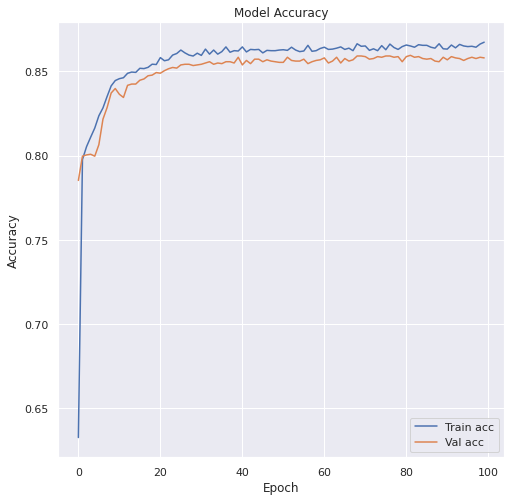

# Bank Customer's Churn Classification <h1> 
  
     

### Problem Statement 
Classifying bank customers based on their previous banking activities, neither they will leave the bank or not

### Resources Used
* Packages: google.colab, pandas, numpy, sklearn, Keras, matplotlib, seaborn
* Dataset: https://www.superdatascience.com/pages/deep-learning

### Network Parameters
* Rectifier Linear Unit (ReLU) - Hidden Layers
* Sigmoid - Output Layer
* Adam optimizer
* Loss: Categorical Crossentropy
* binary_crossentropy

### Model Evaluation

