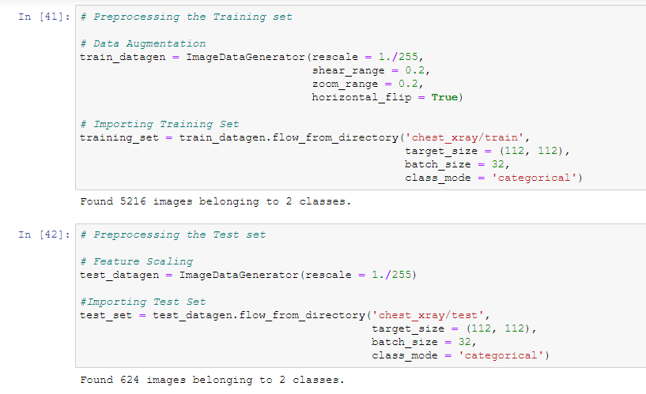
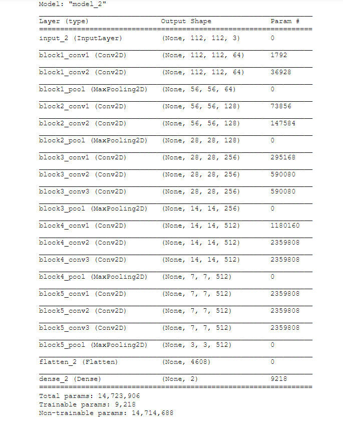
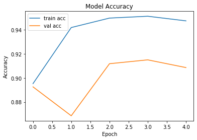
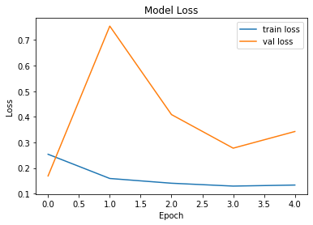

# Lungs Deseases Classificiation <h1> 
     

### Problem Statement: 
Implement an algorithm to classify whether pneumonia is detected in lungs X-ray images.

### Dataset:
The total number of images available for training the model is 5216 and for testing the model is 624 images.
• Dataset Link: https://www.kaggle.com/paultimothymooney/chest-xray-pneumonia?

### Dependencies:
* Keras
* Tensorflow - 2.2.0
* Python - 3.6
* Pandas
* Numpy
* Matplotlib
* Glob

### Data Augmentation:
* Shearing of images
* Random zoom
* Horizontal flips

### Network Parameter:
* Rectifier Linear Unit (ReLU) - Hidden Layers
* Softmax - Output Layer
* Adam optimizer
* Loss: Categorical Crossentropy

### Visualization of Model Accuracy:
* Training Set Accuracy: 94.75% 
* Validation Accuracy: 90.87%

### Visualization of Model Loss:
* Training Set Loss: 0.1333
* Validation Loss: 0.3425

